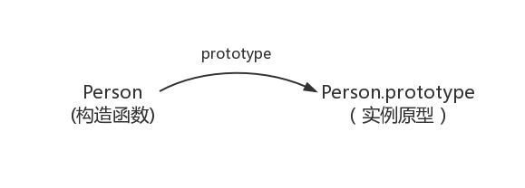
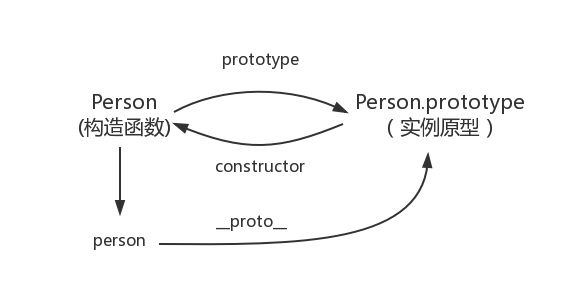
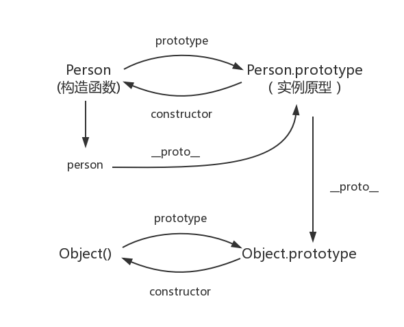

###  javaScript 从原型到原型链
***
### 创建一个构造函数
```js
class Person {

}
const person = new Person()
person.name = 'Kevin'
```
在这个例子中， Person 就是构造函数， 我们使用 new 创建了一个**实例对象**person。

### prototype
```js
class Person {

}
Person.prototype.name = 'Kevin'

const person1 = new Person()
const person2 = new Person()
console.log(person1)
console.log(person2)
```

每个函数都有一个 prototype 属性， 那这个函数的 prototype 属性到底指向的是什么呢？ 是这个函数的原型吗？

其实， 函数的 prototype 属性指向了一个对象， 这个对象正是调用该构造函数创建的实例的**原型** , 也就是上面例子中的 person1 的 preson2 的原型

那什么是原型呢？ 可以这样解释 每一个 js 对象在创建的时候就会与之关联另一个对象，这个对象就是我们所说的原型，每一个对象都会从原型继承属性


### proto
这是每一个js对象都具有的一个属性，叫__proto__。 这个属性会指向该对象的原型
```js
class Person() {}

const person = new Person()

conole.log(person.__proto__ === Person.prototype)
```

### constructor
每一个原型都有一个 constructor 属性指向关联的构造函数
```js
class Preson {}

console.log( Person === Person.prototype.constructor ) // true
```

综上所述 我们已经得出：
```js
class Person {}  // 构造函数

const person = new Person() // 实例对象

person.__proto__ == Person.prototype //  true  实例对象的__proto__ 等于  构造函数的 prototype

Person.prototype.constructor == Person // true  构造函数的 prototype 里面的 constructor 又指回了构造函数本身

// Object.getPrototypeOf() 获取对象的原型
Object.getPrototypeOf(person) === Person.prototype  true // new出来的实例的原型 就是 构造函数的 prototype
```



### 实例 与 原型
当读取实例的属性时，如果找不到，就会查找与对象关联的原型中的属性， 如果还查不到， 就去找原型的原型， 一直找到最顶层为止

```js
class Person {}
Person.name = '大哥'

const person = new Person()
person.name = "小弟"
console.log(person.name) // 小弟

delete person.name
console.log(person.name) // 大哥
```

### 原型的原型

原型本身是一个对象，  既然是对象我们之间用原始方法创建它,
```js
const obj = new Object()
obj.name = '小弟'
```
原型对象就是通过 Object 构造函数生成的， 结合之前所讲， 实例的__proto__指向构造函数的 prototype， 所以


### 原型链
那 Object.prototype 的原型呢？
答案是 Null

```js
console.log(Object.prototype.__proto__ === null)  // true
```

**null表示没有对象，即该处不应该有值**

